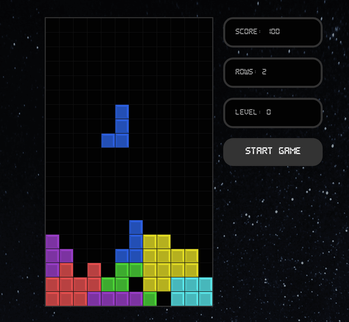

# react-tetris

Creating a simple game in React without canvas.

- [**How to Build Tetris in React**](https://youtu.be/ZGOaCxX8HIU)
- [**Making setInterval Declarative with React Hooks**](https://overreacted.io/making-setinterval-declarative-with-react-hooks/)

